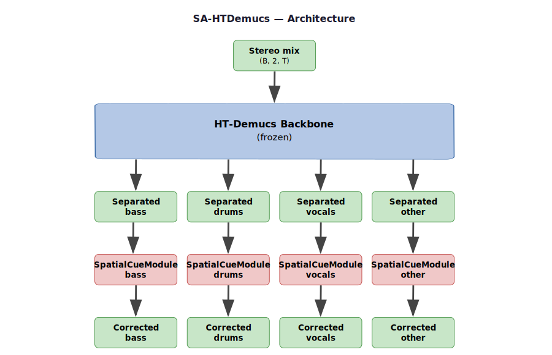
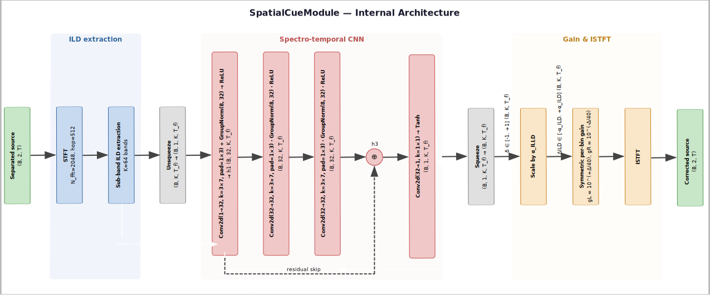

# SA-HTDemucs

[](https://python.org)

Spatially-Aware HT-Demucs (**SA-HTDemucs**) extends the pre-trained 
__[HT-Demucs](https://github.com/facebookresearch/demucs)__ music source separator with explicit preservation of spatial
cues. From an input mixture $x_{gt}$, HT-Demucs separates $S=4$ sources (bass, drums, vocals, other). For each of the 
separated sources $\hat{s}$, a Spatial Cue Module estimates the Interaural Level Difference $\widehat{ILD}^{(s)}_{k}(t)$ 
in the time-frequency domain, which is related to the perceived left/right balance, and predicts a time-frequency correction 
$\Delta ILD_{k}(t)$ to be applied to $\hat{s}$ to replicate $ILD^{(s)}_{k,gt}(t)$ of the groundtruth source $s_{gt}$.
While the frozen HT-Demucs backbone provides strong separation quality for free, only the Spatial Cue Modules are trained,
making the approach practical on a small spatially-annotated dataset. SA-HTdemucs has been trained and evaluated on 
binauralMUSDB18-HQ, a novel binaural dataset synthesized by convolving each source stem in 
[MUSDB18-HQ](https://sigsep.github.io/datasets/musdb.html#musdb18-compressed-stems) dataset with open-source Head-Related
Transfer Functions (HRTFs) at randomized horizontal positions (HRIR from 
[SADIE II](https://www.york.ac.uk/sadie-project/database.html) dataset). 
Samples are available for listening tests [on our sample page](https://polimi-ispl.github.io/sahtdemucs/).

---

## Architecture



`SA-HTDemucs` wraps a frozen, pre-trained HT-Demucs model and attaches one `SpatialCueModule` per source ($S=4$). 
Only the spatial heads (~700 K parameters) are updated during training; the HT-Demucs backbone (~80 M parameters) stays 
frozen.

| Component            | Parameters         | Role |
|----------------------|--------------------|---|
| HT-Demucs backbone   | ~80 M (frozen)     | Music source separation |
| SpatialCueModule × S | ~700 K (trainable) | Per-source ILD correction |

---

## Spatial Cue Module

The `SpatialCueModule` analyses the **per-sub-band, per-frame ILD** of each separated source  $\widehat{ILD}^{(s)}_k(t)$ 
and applies a learned time-frequency-resolved ILD correction $\Delta ILD_k(t)$ so that each source preserves a meaningful
stereo position.

Two architectures are available, selectable via `spatial_arch`:

### `"cnn1d"` — Temporal CNN (default)

Conv1d layers operate along the time axis only; each frequency band is processed independently.

```
ILD map (B, n_bands, T_frames)
    → Conv1d(n_bands → hidden, k=kernel_size) → ReLU
    → Conv1d(hidden  → hidden, k=kernel_size) → ReLU
    → Conv1d(hidden  → n_bands, k=1)          → Tanh   ∈ [−1, +1]
    → × ild_scale                                        dB
```

Default parameters: `hidden=64`, `n_fft=2048`, `hop_length=512`, `n_bands=32`, `ild_scale=6.0`, `kernel_size=7`.

### `"cnn2d"` — Spectro-temporal CNN

Conv2d layers jointly model frequency and time, capturing cross-band patterns (e.g. "apply a larger correction at low 
frequencies when high frequencies show a consistent ILD offset").  A **global context branch** (temporal mean per 
frequency band) captures DC ILD offsets, freeing the local branch to focus on fine spectro-temporal variations. 
The output projection is zero-initialised so corrections start near zero at the beginning of training.

```
ILD map (B, n_bands, T_frames)
    → unsqueeze(1) → (B, 1, n_bands, T_frames)

Local branch (3 × Conv2d with GroupNorm, internal residual layer1 → layer3):
    layer1: Conv2d(1→hidden, freq_k×time_k) → GroupNorm → ReLU    → h1
    layer2: Conv2d(hidden→hidden, ...)       → GroupNorm → ReLU
    layer3: Conv2d(hidden→hidden, ...)       → GroupNorm → ReLU + h1 → h3

Global context branch (collapses time axis):
    mean over T → Conv2d(1→hidden, freq_k×1) → ReLU → broadcast over T

Fusion + projection:
    (h3 + global) → Conv2d(hidden→1, 1×1) → Tanh ∈ [−1, +1]
    → squeeze(1) → (B, n_bands, T_frames)
    → × ild_scale                             dB
```



Default parameters: `hidden=32`, `n_fft=2048`, `hop_length=512`, `n_bands=32`, `ild_scale=6.0`, `freq_kernel=3`, 
`time_kernel=7`.

### Gain application (shared by both architectures)

At each forward pass both modules:

1. Compute the STFT of the separated source and partition the frequency bins into `n_bands` sub-bands, either by splitting 
the linear frequency axis into equal-width intervals (`band_scale`=`linear`) or by splitting the mel-frequency axis into 
equal-width intervals and mapping each STFT bin to the mel interval containing its center frequency (`band_scale`=`mel`). 
Derive a per-band ILD trajectory $\widehat{ILD}^{(s)}_k(t) \in \mathbb{R}^{B \times K \times T_{frames}}$, where 
$K$=`n_bands`.
2. Feed the ILD map into the CNN to predict a correction $\delta_{ILD} \in [−1, +1] \in \mathbb{R}^{B \times K \times T_{frames}}$ 
per band per frame.
3. Scale $\delta_{ILD}$ by `ild_scale` to obtain $\Delta_{ILD}$ in dB, then apply a **symmetric time-varying per-bin 
gain** in the STFT domain:
   - Left channel: $g_L = 10^{+\Delta/40}$ 
   - Right channel: $g_R = 10^{-\Delta/40}$
   - $g_L \cdot g_R = 1$ ⟹ total loudness is preserved
4. ISTFT reconstructs the corrected waveform.

The entire pipeline (STFT → CNN → gain → ISTFT) is fully differentiable.

> **Note on ITD** — `compute_itd_samples` (GCC-PHAT soft-argmax) and
> `apply_itd` (fractional delay via FFT phase shift) are implemented in
> `spatial.py` but ITD correction is currently disabled in the spatial
> modules.  A single scalar ITD over a full music segment is not a meaningful
> supervision target for polyphonic sources.  Per-band or short-time ITD
> estimation is reserved for future work.

---

## Installation

```bash
git clone https://github.com/your-username/htdemucswspatial
cd htdemucswspatial
pip install demucs torchaudio soundfile
```

---

## Quick Start

### Python API

```python
import torch
from demucs.pretrained import get_model
from sahtdemucs.model import SAHTDemucs

bag   = get_model("htdemucs")
base  = bag.models[0] if hasattr(bag, "models") else bag

# Default: cnn1d spatial heads
model = SAHTDemucs(base, sources=base.sources)

# Spectro-temporal variant
model = SAHTDemucs(base, sources=base.sources, spatial_arch="cnn2d")

# Only SpatialCueModule weights are updated
optimizer = torch.optim.Adam(model.trainable_parameters(), lr=1e-3)

mix = torch.randn(1, 2, 44100 * 6)   # (B, 2, T)
estimates, deltas = model(mix)        # (B, S, 2, T), [S × (B, n_bands, T_frames)]
```

### Full-track inference

```python
# Chunked overlap-add backbone + full-signal spatial correction
stems = model.separate(wav)   # (2, T) → (S, 2, T)
```

### Training the spatial heads

```python
from sahtdemucs.losses import SpatialLoss

loss_fn = SpatialLoss(lambda_si=0.0, lambda_ild=1.0)  # ILD supervision only

for mix, targets in train_loader:          # mix: (B,2,T)  targets: (B,S,2,T)
    estimates, _ = model(mix)
    loss = loss_fn(estimates, targets)
    loss.backward()
    optimizer.step(); optimizer.zero_grad()
```

See `notebook/TrainSAHTDemucs.ipynb` for a complete training and evaluation example.

---

## Loss Function

`SpatialLoss` is an objective that supervises **sub-band** spatial cue fidelity for each of the $S$ sources:

$$
\mathcal{L} = \frac{1}{S} \sum_{s=1}^{S} \left(
\lambda_{\text{ILD}} \cdot \mathcal{L}_{\text{ILD}}^{(s)} + \lambda_{\text{SI}} \cdot \mathcal{L}_{\text{SI-SDR}}^{(s)}
\right)
$$

$\mathcal{L}_{\text{SI-SDR}}^{(s)}$ is a loss term related to separation quality and based on the evaluation of 
Scale-Invariant Signal to Distortion Ration (SI-SDR). $\mathcal{L}_{\text{ILD}}^{(s)}$ is the MSE between corrected source
time-frequency ILD and groundtruth one, defined as

$$
\mathcal{L}_{\text{ILD}}^{(s)} =
  \frac{1}{K \cdot T_f} \sum_{k=1}^{K} \sum_{t=1}^{T_f}
  \left(
    \widehat{\text{ILD}}_k^{(s)}(t) - \text{ILD}_{k,\,\text{gt}}^{(s)}(t)
  \right)^2
$$

where $K$ = `n_bands` and $T_f$ is the number of STFT frames. Here $\lambda_{\text{SI-SDR}}=0$ as we want to keep a purely
spatial loss.

### Loss hyperparameters

|          Symbol           | Parameter    | Default | Description                               |
|:-------------------------:|--------------|:-------:|-------------------------------------------|
| $\lambda_{\text{SI}}$ | `lambda_si`  |  `0.0`  | Weight of the SI-SDR penalty              |
|  $\lambda_{\text{ILD}}$   | `lambda_ild` |  `1.0`  | Weight of the sub-band ILD penalty        |
|            $K$            | `n_bands`    |  `32`   | Number of equal-width frequency sub-bands |
|             —             | `n_fft`      | `2048`  | STFT FFT size                             |
|             —             | `hop_length` |  `512`  | STFT hop size                             |

```python
from sahtdemucs.losses import SpatialLoss

# ILD supervision only (recommended for SAHTDemucs)
loss_fn = SpatialLoss(lambda_si=0.0, lambda_ild=1.0)
loss    = loss_fn(estimates, targets)   # (B,S,2,T), (B,S,2,T) → scalar

# Joint reconstruction + ILD
loss_fn = SpatialLoss(lambda_si=1.0, lambda_ild=1.0)
```

---

## Repository Map

```
sahtdemucs/
├── sahtdemucs/               ← Python package
│   ├── __init__.py           ← public API
│   ├── model.py              ← SAHTDemucs
│   ├── cue_module.py         ← SpatialCueModule (cnn1d), SpatialCueModule2D (cnn2d), build_spatial_module
│   ├── spatial.py            ← compute_ild, compute_ild_bands, compute_itd_samples, apply_itd
│   ├── losses.py             ← SpatialLoss, SISNRLoss
│   └── dataset.py            ← MusdbSpatialDataset
├── notebook/
│   ├── TrainHTDemucs.ipynb         ← baseline HTDemucs training
│   ├── TrainSAHTDemucs.ipynb       ← spatial heads training & evaluation
│   └── PrepareOnlineDemo.ipynb     ← generate demo page audio
├── docs/
│   ├── images/
│   │   ├── architecture.svg
│   │   ├── spatial_cue_module_cnn.svg
│   │   └── spatial_cue_module_cnn2d.svg
│   └── demopage/             ← online listening demo (HTML/JS)
├── checkspatial/             ← REAPER project for informal spatial QA
├── runs/                     ← saved model checkpoints (.pt)
└── plot/                     ← training/validation loss and per-band MAE plots
```

---

## Module Reference

### `sahtdemucs/model.py` — SAHTDemucs

```python
model = SAHTDemucs(
    base_model,
    sources       = base.sources,
    spatial_arch  = "cnn1d",   # or "cnn2d"
    hidden        = 64,        # 32 for cnn2d
    n_fft         = 2048,
    hop_length    = 512,
    n_bands       = 32,
    ild_scale     = 6.0,
    band_scale    = "linear",
    sample_rate   = 44100,
    freeze_base   = True,
)

estimates, deltas = model(mix)    # (B, S, 2, T), [S × (B, n_bands, T_frames)]
stems = model.separate(wav)       # full-track (2, T) → (S, 2, T)

optimizer = torch.optim.Adam(model.trainable_parameters(), lr=3e-4)
print(model.count_trainable())    # number of trainable parameters
```

---

### `sahtdemucs/cue_module.py` — Spatial correction heads

```python
from sahtdemucs.cue_module import SpatialCueModule, SpatialCueModule2D, build_spatial_module

# Temporal CNN (cnn1d)
mod = SpatialCueModule(hidden=64, n_bands=32, ild_scale=6.0)
corrected, delta = mod(source_estimate)
# corrected: (B, 2, T)
# delta:     (B, n_bands, T_frames) in [−1, +1]

# Spectro-temporal CNN (cnn2d)
mod = SpatialCueModule2D(hidden=32, n_bands=32, ild_scale=6.0)

# Factory
mod = build_spatial_module("cnn2d", n_bands=32, ild_scale=6.0)
```

---

### `sahtdemucs/spatial.py` — Low-level spatial cue primitives

| Function | Input | Output | Notes |
|---|---|---|---|
| `compute_ild(left, right)` | `(B, T)` | `(B,)` dB | Broadband RMS ratio L/R |
| `compute_ild_bands(left, right, n_fft, hop, n_bands)` | `(B, T)` | `(B, n_bands, T_frames)` dB | Per-sub-band, per-frame ILD via STFT |
| `compute_itd_samples(left, right, max_lag)` | `(B, T)` | `(B,)` samples | GCC-PHAT + soft-argmax (differentiable) |
| `apply_itd(signal, delay_samples)` | `(B, T)`, `(B,)` | `(B, T)` | Fractional delay via FFT phase shift |

All functions are fully differentiable.

---

### `sahtdemucs/losses.py` — Loss functions

| Class | Formula                                                                                                           |
|---|-------------------------------------------------------------------------------------------------------------------|
| `SISNRLoss` | $-\text{SI-SDR}$ averaged over batch and channels                                                                 |
| `SpatialLoss` | $$ \mathcal{L} = \frac{1}{S} \sum_{s=1}^{S} \left(\lambda_{\text{SI}} \cdot \mathcal{L}_{\text{SI-SDR}}^{(s)} +\lambda_{\text{ILD}} \cdot \mathcal{L}_{\text{ILD}}^{(s)}\right)$$ |

---

### `sahtdemucs/dataset.py` — MUSDB18-HQ DataLoader

Reads mixture and source stems from a MUSDB18-HQ style directory tree. Returns random fixed-length segments with optional
gain (±6 dB) and channel-flip augmentation.

```
musdb18hq/
└── train/
    └── <track name>/
        ├── mixture.wav
        ├── drums.wav  ├── bass.wav  ├── other.wav  └── vocals.wav
```

```python
from sahtdemucs.dataset import MusdbSpatialDataset
from torch.utils.data import DataLoader

ds     = MusdbSpatialDataset("musdb18hq/", split="train", segment_len=44100*6)
loader = DataLoader(ds, batch_size=4, shuffle=True, num_workers=4)
mix, targets = next(iter(loader))   # (4, 2, 264600),  (4, 4, 2, 264600)
```

---

## Citation

If you build on this work, please also cite the original Demucs papers:

```bibtex
@inproceedings{rouard2022hybrid,
  title     = {Hybrid Transformers for Music Source Separation},
  author    = {Rouard, Simon and Massa, Francisco and D{\'e}fossez, Alexandre},
  booktitle = {ICASSP 2023},
  year      = {2023}
}
```