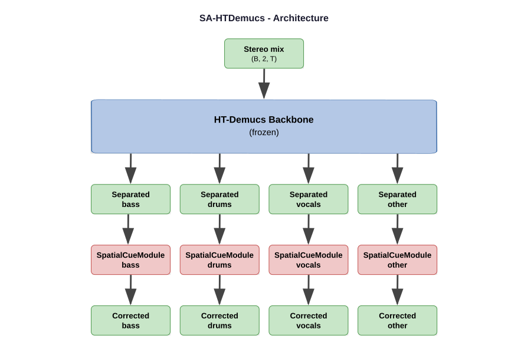
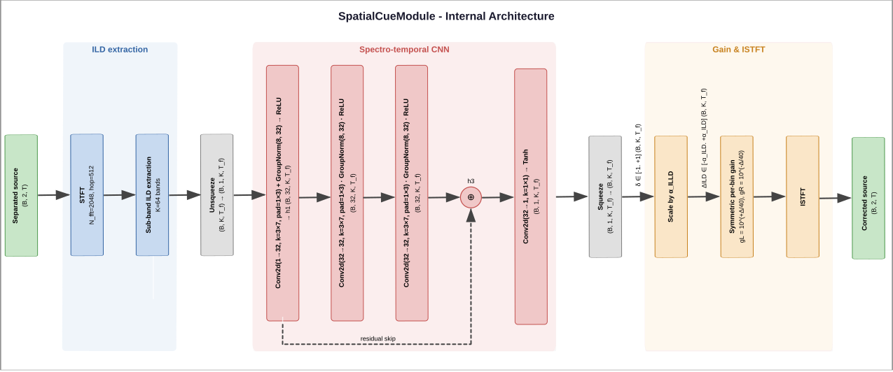

# SA-HTDemucs

[](https://python.org)

Spatially-Aware HT-Demucs (**SA-HTDemucs**) extends the pre-trained 
__[HT-Demucs](https://github.com/facebookresearch/demucs)__ music source separator with explicit preservation of spatial
cues. From an input mixture $x_{gt}$, HT-Demucs separates $S=4$ sources (bass, drums, vocals, other). For each of the 
separated sources $s_{sep}$, a Spatial Cue Module estimates the Interaural Level Difference in the time-frequency domain, 
which is related to the perceived left/right balance, and predicts a time-frequency correction to be applied to 
$s_{sep}$ to replicate the ILD of the groundtruth source $s_{gt}$.
While the frozen HT-Demucs backbone provides strong separation quality for free, only the Spatial Cue Modules are trained,
making the approach practical on a small spatially-annotated dataset. SA-HTdemucs has been trained and evaluated on 
binauralMUSDB18-HQ, a novel binaural dataset synthesized by convolving each source stem in 
[MUSDB18-HQ](https://sigsep.github.io/datasets/musdb.html#musdb18-compressed-stems) dataset with open-source Head-Related
Transfer Functions (HRTFs) at randomized horizontal positions (HRIR from 
[SADIE II](https://www.york.ac.uk/sadie-project/database.html) dataset). 
Samples are available for listening tests [on our sample page](https://polimi-ispl.github.io/sahtdemucs/).

---

## Architecture



`SA-HTDemucs` wraps a frozen, pre-trained HT-Demucs model and attaches one `SpatialCueModule` per source ($S=4$). 
Only the spatial heads (~700 K parameters) are updated during training; the HT-Demucs backbone (~80 M parameters) stays 
frozen.

| Component            | Parameters         | Role |
|----------------------|--------------------|---|
| HT-Demucs backbone   | ~80 M (frozen)     | Music source separation |
| SpatialCueModule × S | ~700 K (trainable) | Per-source ILD correction |

---

## Spatial Cue Module

The `SpatialCueModule` analyses the **per-sub-band, per-frame ILD** of each separated source  $\widehat{ILD}^{(s)}_k(t)$ 
and applies a learned time-frequency-resolved ILD correction $\Delta ILD_k(t)$ so that each source preserves a meaningful
stereo position.

Two architectures are available, selectable via `spatial_arch`:

### `"cnn1d"` — Temporal CNN (default)

Conv1d layers operate along the time axis only; each frequency band is processed independently.

```
ILD map (B, n_bands, T_frames)
    → Conv1d(n_bands → hidden, k=kernel_size) → ReLU
    → Conv1d(hidden  → hidden, k=kernel_size) → ReLU
    → Conv1d(hidden  → n_bands, k=1)          → Tanh   ∈ [−1, +1]
    → × ild_scale                                        dB
```

Default parameters: `hidden=64`, `n_fft=2048`, `hop_length=512`, `n_bands=32`, `ild_scale=6.0`, `kernel_size=7`.

### `"cnn2d"` — Spectro-temporal CNN

Conv2d layers jointly model frequency and time, capturing cross-band patterns (e.g. "apply a larger correction at low 
frequencies when high frequencies show a consistent ILD offset").  A **global context branch** (temporal mean per 
frequency band) captures DC ILD offsets, freeing the local branch to focus on fine spectro-temporal variations. 
The output projection is zero-initialised so corrections start near zero at the beginning of training.

```
ILD map (B, n_bands, T_frames)
    → unsqueeze(1) → (B, 1, n_bands, T_frames)

Local branch (3 × Conv2d with GroupNorm, internal residual layer1 → layer3):
    layer1: Conv2d(1→hidden, freq_k×time_k) → GroupNorm → ReLU    → h1
    layer2: Conv2d(hidden→hidden, ...)       → GroupNorm → ReLU
    layer3: Conv2d(hidden→hidden, ...)       → GroupNorm → ReLU + h1 → h3

Global context branch (collapses time axis):
    mean over T → Conv2d(1→hidden, freq_k×1) → ReLU → broadcast over T

Fusion + projection:
    (h3 + global) → Conv2d(hidden→1, 1×1) → Tanh ∈ [−1, +1]
    → squeeze(1) → (B, n_bands, T_frames)
    → × ild_scale                             dB
```



Default parameters: `hidden=32`, `n_fft=2048`, `hop_length=512`, `n_bands=32`, `ild_scale=6.0`, `freq_kernel=3`, 
`time_kernel=7`.

### Gain application (shared by both architectures)

At each forward pass both modules:

1. Compute the STFT of the separated source and partition the frequency bins into `n_bands` sub-bands, either by splitting 
the linear frequency axis into equal-width intervals (`band_scale`=`linear`) or by splitting the mel-frequency axis into 
equal-width intervals and mapping each STFT bin to the mel interval containing its center frequency (`band_scale`=`mel`). 
Derive a per-band ILD trajectory $\widehat{ILD}^{(s)}_k(t) \in \mathbb{R}^{B \times K \times T_{frames}}$, where 
$K$=`n_bands`.
2. Feed the ILD map into the CNN to predict a correction $\delta_{ILD} \in [−1, +1] \in \mathbb{R}^{B \times K \times T_{frames}}$ 
per band per frame.
3. Scale $\delta_{ILD}$ by $\alpha_{ILD}$ = `ild_scale` to obtain $\Delta_{ILD}$ in dB, then apply a **symmetric time-varying per-bin 
gain** in the STFT domain:
   - Left channel: $g_L = 10^{+\Delta/40}$ 
   - Right channel: $g_R = 10^{-\Delta/40}$
   - $g_L \cdot g_R = 1$ ⟹ total loudness is preserved
4. ISTFT reconstructs the corrected waveform.

The entire pipeline (STFT → CNN → gain → ISTFT) is fully differentiable.

> **Note on ITD** — `compute_itd_samples` (GCC-PHAT soft-argmax) and
> `apply_itd` (fractional delay via FFT phase shift) are implemented in
> `spatial.py` but ITD correction is currently disabled in the spatial
> modules.  A single scalar ITD over a full music segment is not a meaningful
> supervision target for polyphonic sources.  Per-band or short-time ITD
> estimation is reserved for future work.

---

## Installation

```bash
git clone https://github.com/your-username/htdemucswspatial
cd htdemucswspatial
pip install demucs torchaudio soundfile
```

---

## Binaural Dataset Generation (binauralMUSDB18-HQ)

SA-HTDemucs is trained and evaluated on **binauralMUSDB18-HQ**, synthesized from
[MUSDB18-HQ](https://sigsep.github.io/datasets/musdb.html#musdb18-compressed-stems) by convolving each source stem with a
Head-Related Impulse Response (HRIR) at a randomized horizontal position, then summing the binaural stems into a
normalized binaural mixture. The script `sahtdemucs/binaural_synth.py` performs this synthesis.

The HRIRs are those of the Neumann KU100 dummy head from the
[SADIE II](https://www.york.ac.uk/sadie-project/database.html) database (subject D1), diffuse-field compensated (DFC),
at 44.1 kHz. HRIR files are expected to be named `azi_{angle}_ele_0_DFC.wav`.

### What it does, per track

1. Down-mixes each stereo stem to mono, then convolves it with the left/right HRIR for the chosen azimuth (elevation
   fixed at 0°).
2. Assigns each of the 4 stems (`vocals`, `bass`, `drums`, `other`) a **distinct** azimuth, drawn *without replacement*
   from the frontal grid `{0, 10, …, 90} ∪ {270, …, 350}` degrees, so sources do not directly overlap — unless a
   metadata file fixes the angles.
3. Writes the binaural stems, the normalized `mixture.wav` (peak-normalized sum of the binaural stems), and a
   `metadata.json` recording the per-stem azimuth angles.

All audio must be at 44.1 kHz (the script raises if a stem has a different sample rate). The output tree matches what
`MusdbSpatialDataset` expects (see [Module Reference](#sahtdemucsdatasetpy--musdb18-hq-dataloader)).

### Arguments

| Argument          | Required | Description                                                                              |
|-------------------|:--------:|------------------------------------------------------------------------------------------|
| `--input_dir`     |   yes    | MUSDB18-HQ root, containing `train/` and `test/`, each with one folder per track.         |
| `--output_dir`    |   yes    | Target root; `train/` and `test/` are created, mirroring the input track structure.      |
| `--hrir_dir`      |   yes    | Folder with the SADIE II HRIR WAVs named `azi_{angle}_ele_0_DFC.wav`.                     |
| `-m`, `--metadata`|    no    | JSON mapping each track's stems to azimuth angles, to reproduce an exact dataset version. |

When `--metadata` is omitted, a new random angle assignment is generated (and saved per track as `metadata.json`).
A reusable metadata file for the published dataset version is provided at `data/binaural_musdb_metadata.json`.

### Usage

```bash
python sahtdemucs/binaural_synth.py \
    --input_dir="path/to/MUSDB18-HQ" \
    --output_dir="path/to/binauralMUSDB18-HQ" \
    --hrir_dir="path/to/SADIE_II/Subject_001_Wav/DFC/44K_16bit"
```

On Windows PowerShell, call the interpreter explicitly and keep the command on a single line:

```powershell
python .\sahtdemucs\binaural_synth.py --input_dir="D:\Dataset\MUSDB18HQ" --output_dir="D:\Dataset\binauralMUSDB18HQ" --hrir_dir="D:\Dataset\SADIEII\Subject_001_Wav\DFC\44K_16bit"
```

To reproduce a fixed dataset version, pass the metadata JSON:

```bash
python sahtdemucs/binaural_synth.py \
    --input_dir="path/to/MUSDB18-HQ" \
    --output_dir="path/to/binauralMUSDB18-HQ" \
    --hrir_dir="path/to/SADIE_II/.../DFC/44K_16bit" \
    -m data/binaural_musdb_metadata.json
```

---

## Quick Start

### Python API

```python
import torch
from demucs.pretrained import get_model
from sahtdemucs.model import SAHTDemucs

bag   = get_model("htdemucs")
base  = bag.models[0] if hasattr(bag, "models") else bag

# Default: cnn1d spatial heads
model = SAHTDemucs(base, sources=base.sources)

# Spectro-temporal variant
model = SAHTDemucs(base, sources=base.sources, spatial_arch="cnn2d")

# Only SpatialCueModule weights are updated
optimizer = torch.optim.Adam(model.trainable_parameters(), lr=1e-3)

mix = torch.randn(1, 2, 44100 * 6)        # (B, 2, T)
estimates, raw_estimates, deltas = model(mix)
# estimates:     (B, S, 2, T)  spatially corrected sources
# raw_estimates: (B, S, 2, T)  raw HTDemucs output (no spatial correction)
# deltas:        [S × (B, n_bands, T_frames)]  CNN corrections in [−1, +1]
```

### Full-track inference

```python
# Chunked overlap-add backbone + full-signal spatial correction
stems = model.separate(wav)   # (2, T) → (S, 2, T)
```

### Training the spatial heads

```python
from sahtdemucs.losses import SpatialLoss

loss_fn = SpatialLoss(lambda_si=0.0, lambda_ild=1.0)  # ILD supervision only

for mix, targets in train_loader:          # mix: (B,2,T)  targets: (B,S,2,T)
    estimates, raw_estimates, _ = model(mix)
    loss, loss_si, loss_ild = loss_fn(estimates, targets, raw_estimates)
    loss.backward()
    optimizer.step(); optimizer.zero_grad()
```

See `notebook/TrainSAHTDemucs.ipynb` for a complete training and evaluation example.

---

## Loss Function

`SpatialLoss` is an objective that supervises both **sub-band** spatial cue fidelity and separation quality for each of 
the $S$ sources

$$
\mathcal{L} = \frac{1}{S} \sum_{s=1}^{S} \left(
\lambda_{\text{ILD}} \cdot \mathcal{L}_{\text{ILD}}^{(s)} + \lambda_{\text{SI}} \cdot \mathcal{L}_{\text{SI-SDR}}^{(s)}
\right).
$$

$\mathcal{L}_{\text{ILD}}^{(s)}$ is the MSE between the corrected source time-frequency ILD and the ground-truth one,
defined as

$$
\mathcal{L}_{\text{ILD}}^{(s)} =
  \frac{1}{K \cdot T_f} \sum_{k=1}^{K} \sum_{t=1}^{T_f}
  \left(
    \widehat{\text{ILD}}_k^{(s)}(t) - \text{ILD}_{k,\text{gt}}^{(s)}(t)
  \right)^2,
$$

where $K$ = `n_bands` and $T_f$ is the number of STFT frames.

$\mathcal{L}_{\text{SI-SDR}}^{(s)}$ is not a plain SI-SDR loss but a one-sided **degradation penalty**: it penalises 
the spatial correction only when it lowers the SI-SDR of the corrected source $\hat{s}$ below that of the frozen HT-Demucs
output $\bar{s}$ by more than a tolerated margin $m_{dB}$ = `si_margin_db` (in dB). With $\text{SI-SDR}(\cdot)$ evaluated
against the ground-truth source $s_{gt}$,

$$
\mathcal{L}_{\text{SI-SDR}}^{(s)} =
  \text{ReLU}\left(
    \text{SI-SDR}(\bar{s}, s_{gt}) - \text{SI-SDR}(\hat{s}, s_{gt}) - m_{dB}
  \right),
$$

where

$$ 
\text{SI-SDR}(\hat{s}, s_{gt}) = 10 \cdot \log_{10} \left( \frac{\left\| \dfrac{\langle \hat{s}, 
s_{gt} \rangle}{\|s_{gt}\|^2} \cdot s_{gt} \right\|^2} {\left\| \hat{s} - \dfrac{\langle \hat{s}, s_{gt} \rangle}
{\|s_{gt}\|^2} \cdot s_{gt}\right\|^2} \right) \quad \text{[dB]}
$$

is the **Scale-invariant Signal-To-Distortion Ratio**.

The $\mathcal{L}_{\text{SI-SDR}}^{(s)}$ term is always non-negative and is zero (no gradient) as long as the spatial head does not hurt separation beyond the
margin, letting it improve ILD freely. Setting $\lambda_{\text{SI}}=0$ recovers a purely spatial loss (and lets
`raw_estimates` be omitted in the forward call).

The forward pass takes the raw HT-Demucs output and returns the total loss together with its two (already weighted)
components for logging:

```python
total, si_part, ild_part = loss_fn(estimates, targets, raw_estimates)
total.backward()
```

`raw_estimates` is required whenever `lambda_si > 0`; if `None`, the SI-SDR degradation term is skipped.

### Loss hyperparameters

|         Symbol         | Parameter      | Default | Description                                            |
|:----------------------:|----------------|:-------:|--------------------------------------------------------|
| $\lambda_{\text{SI}}$  | `lambda_si`    |  `1.0`  | Weight of the SI-SDR degradation penalty               |
| $\lambda_{\text{ILD}}$ | `lambda_ild`   |  `1.0`  | Weight of the sub-band ILD penalty                     |
|        $m_{dB}$        | `si_margin_db` |  `0.5`  | Tolerated SI-SDR degradation (dB) before it is penalised |
|          $K$           | `n_bands`      |  `32`   | Number of equal-width frequency sub-bands              |
|           —            | `n_fft`        | `2048`  | STFT FFT size                                          |
|           —            | `hop_length`   |  `512`  | STFT hop size                                          |
|           —            | `band_scale`   |`linear` | Sub-band spacing — `linear` or `mel`                   |

```python
from sahtdemucs.losses import SpatialLoss

# ILD supervision only (recommended for SAHTDemucs) — raw_estimates not needed
loss_fn = SpatialLoss(lambda_si=0.0, lambda_ild=1.0)
total, si_part, ild_part = loss_fn(estimates, targets)   # (B,S,2,T), (B,S,2,T) → 3 scalars

# Joint ILD + SI-SDR-degradation guard (raw_estimates required when lambda_si > 0)
loss_fn = SpatialLoss(lambda_si=1.0, lambda_ild=1.0, si_margin_db=0.5)
total, si_part, ild_part = loss_fn(estimates, targets, raw_estimates)
```

---

## Repository Map

```
sahtdemucs/
├── sahtdemucs/               ← Python package
│   ├── __init__.py           ← public API
│   ├── model.py              ← SAHTDemucs
│   ├── cue_module.py         ← SpatialCueModule (cnn1d), SpatialCueModule2D (cnn2d), build_spatial_module
│   ├── spatial.py            ← compute_ild, compute_ild_bands, compute_itd_samples, apply_itd
│   ├── losses.py             ← SpatialLoss (sub-band ILD MSE + SI-SDR degradation guard)
│   ├── dataset.py            ← MusdbSpatialDataset
│   └── binaural_synth.py     ← binauralMUSDB18-HQ synthesis from MUSDB18-HQ + SADIE II HRIRs
├── data/
│   └── binaural_musdb_metadata.json   ← per-track stem azimuths (reproducible dataset)
├── notebook/
│   ├── TrainHTDemucs.ipynb         ← baseline HTDemucs training
│   ├── TrainSAHTDemucs.ipynb       ← spatial heads training & evaluation
│   └── PrepareOnlineDemo.ipynb     ← generate demo page audio
├── docs/
│   ├── images/
│   │   ├── architecture.svg
│   │   ├── spatial_cue_module_cnn.svg
│   │   └── spatial_cue_module_cnn2d.svg
│   └── demopage/             ← online listening demo (HTML/JS)
├── checkspatial/             ← REAPER project for informal spatial QA
├── runs/                     ← saved model checkpoints (.pt)
└── plot/                     ← training/validation loss and per-band MAE plots
```

---

## Module Reference

### `sahtdemucs/binaural_synth.py` — Binaural tracks synthesis

Synthesizes **binauralMUSDB18-HQ**, from [MUSDB18-HQ](https://sigsep.github.io/datasets/musdb.html#musdb18-compressed-stems) by convolving each source stem with a
Head-Related Impulse Response (HRIR) at a randomized horizontal position, then summing the binaural stems into a
normalized binaural mixture.

---

### `sahtdemucs/model.py` — SAHTDemucs

```python
model = SAHTDemucs(
    base_model,
    sources       = base.sources,
    spatial_arch  = "cnn1d",   # or "cnn2d"
    hidden        = 64,        # 32 for cnn2d
    n_fft         = 2048,
    hop_length    = 512,
    n_bands       = 32,
    ild_scale     = 6.0,
    band_scale    = "linear",
    sample_rate   = 44100,
    freeze_base   = True,
)

estimates, deltas = model(mix)    # (B, S, 2, T), [S × (B, n_bands, T_frames)]
stems = model.separate(wav)       # full-track (2, T) → (S, 2, T)

optimizer = torch.optim.Adam(model.trainable_parameters(), lr=3e-4)
print(model.count_trainable())    # number of trainable parameters
```

### `sahtdemucs/cue_module.py` — Spatial correction heads

```python
from sahtdemucs.cue_module import SpatialCueModule, SpatialCueModule2D, build_spatial_module

# Temporal CNN (cnn1d)
mod = SpatialCueModule(hidden=64, n_bands=32, ild_scale=6.0)
corrected, delta = mod(source_estimate)
# corrected: (B, 2, T)
# delta:     (B, n_bands, T_frames) in [−1, +1]

# Spectro-temporal CNN (cnn2d)
mod = SpatialCueModule2D(hidden=32, n_bands=32, ild_scale=6.0)

# Factory
mod = build_spatial_module("cnn2d", n_bands=32, ild_scale=6.0)
```

---

### `sahtdemucs/spatial.py` — Low-level spatial cue primitives

| Function | Input | Output | Notes |
|---|---|---|---|
| `compute_ild(left, right)` | `(B, T)` | `(B,)` dB | Broadband RMS ratio L/R |
| `compute_ild_bands(left, right, n_fft, hop, n_bands)` | `(B, T)` | `(B, n_bands, T_frames)` dB | Per-sub-band, per-frame ILD via STFT |
| `compute_itd_samples(left, right, max_lag)` | `(B, T)` | `(B,)` samples | GCC-PHAT + soft-argmax (differentiable) |
| `apply_itd(signal, delay_samples)` | `(B, T)`, `(B,)` | `(B, T)` | Fractional delay via FFT phase shift |

All functions are fully differentiable.

---

### `sahtdemucs/losses.py` — Loss functions

| Class | Formula                                                                                                           |
|---|-------------------------------------------------------------------------------------------------------------------|
| `SpatialLoss` | $$ \mathcal{L} = \frac{1}{S} \sum_{s=1}^{S} \left(\lambda_{\text{SI}} \cdot \mathcal{L}_{\text{SI-SDR}}^{(s)} +\lambda_{\text{ILD}} \cdot \mathcal{L}_{\text{ILD}}^{(s)}\right)$$ where $\mathcal{L}_{\text{SI-SDR}}^{(s)}$ is the one-sided SI-SDR degradation penalty (see [Loss Function](#loss-function)) and $\mathcal{L}_{\text{ILD}}^{(s)}$ the sub-band ILD MSE. Returns `(total, si_part, ild_part)`. |

---

### `sahtdemucs/dataset.py` — MUSDB18-HQ DataLoader

Reads mixture and source stems from a MUSDB18-HQ style directory tree. Returns random fixed-length segments with optional
gain (±6 dB) and channel-flip augmentation.

```
musdb18hq/
└── train/
    └── <track name>/
        ├── mixture.wav
        ├── drums.wav  ├── bass.wav  ├── other.wav  └── vocals.wav
```

```python
from sahtdemucs.dataset import MusdbSpatialDataset
from torch.utils.data import DataLoader

ds     = MusdbSpatialDataset("musdb18hq/", split="train", segment_len=44100*6)
loader = DataLoader(ds, batch_size=4, shuffle=True, num_workers=4)
mix, targets = next(iter(loader))   # (4, 2, 264600),  (4, 4, 2, 264600)
```

<!-- ---

## Citation

If you build on this work, please also cite the original Demucs papers:

```bibtex
@inproceedings{rouard2022hybrid,
  title     = {Hybrid Transformers for Music Source Separation},
  author    = {Rouard, Simon and Massa, Francisco and D{\'e}fossez, Alexandre},
  booktitle = {ICASSP 2023},
  year      = {2023}
}
```
-->